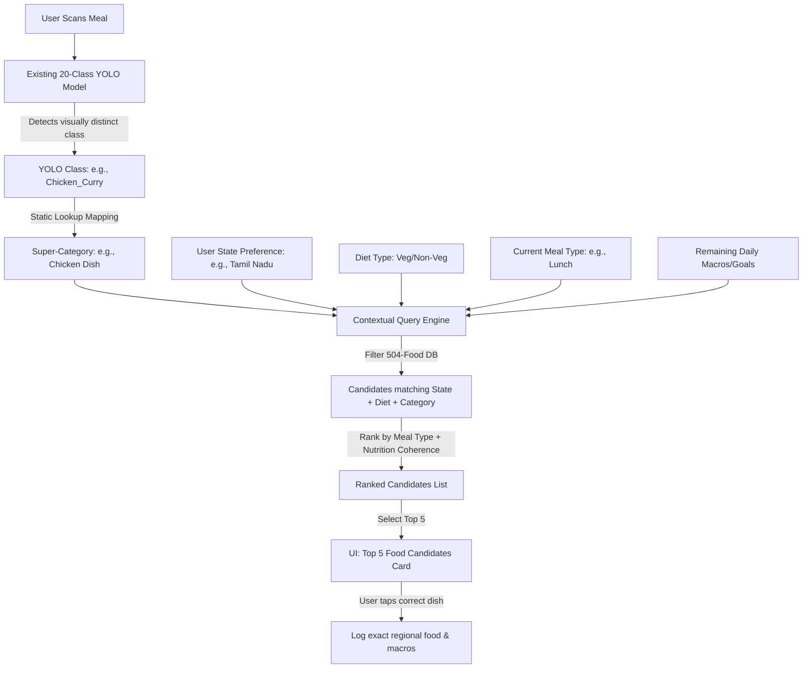

# NutriVision Hybrid Food Recognition System

To solve the cold-start problem of recognizing 504 regional Indian foods without immediately collecting massive training sets and training a 120-class YOLO model, we implement a **Hybrid Food Recognition System**.

This system combines:
1. **A Broad Object Detector (YOLO)**: Recognizes 20 visual food categories.
2. **A Contextual Query Engine (FastAPI)**: Narrows down the category to the top 5 most likely regional dishes using user state, diet type, time of day, and nutrition goals.
3. **An Interactive UI (React Native / React)**: Displays the top 5 candidates for quick user verification and one-tap logging.

---

## 1. System Architecture Overview

---

## 2. YOLO Class to Super-Category Mapping

The existing 20 classes output by the YOLO food scanner map directly to our 12 Super-Categories:

| YOLO Model Class | Mapped Super-Category | Matching Database Focus |
| :--- | :--- | :--- |
| `Chicken_Curry` | **Chicken Dish** | Non-veg chicken curries, dry dishes, Chettinad, Korma. |
| `Plain_Omelette` | **Egg Dish** | Egg curries, scrambles, omelettes. |
| `Spinach_Paneer` | **Curry** | Vegetarian curries, paneer dishes, vegetable stews. |
| `Appam` | **Rice Dish** | Rice-batter appams, fermented bread equivalents. |
| `Avial` | **Curry** | Regional vegetable mixed curries. |
| `Banana_Chips` | **Snack** | Banana chips, fried snacks, dry crisps. |
| `Chapati_Roti` | **Bread/Roti** | Roti, parathas, poori, flatbreads. |
| `Chocolate_Cake` | **Dessert** | Cakes, pedas, ladoos, sweet puddings. |
| `Fruit_Salad` | **Snack** | Fruits, raw healthy snacks. |
| `Idli` | **Idli Variant** | Standard idlis, rava idlis, state idli variants. |
| `Kulfi` | **Dessert** | Frozen desserts, ice cream equivalents. |
| `Marble_Cake` | **Dessert** | Standard baked desserts. |
| `Masala_Dosa` | **Dosa Variant** | Standard dosas, karam dosas, neer dosas. |
| `Masala_Vada` | **Snack** | Medu vadas, maddur vadas, crunchy pakoras. |
| `Mutton_Biryani` | **Rice Dish** | Regional biryanis, pulao, khichdi. |
| `Pancake` | **Bread/Roti** | Breakfast pancakes, sweet flatbreads. |
| `Sambar` | **Dal** | Lentil-based dals, sambar, rasam, kadi. |
| `Uttapam` | **Dosa Variant** | Thick savory pancakes, dosa variants. |
| `Lemonade` | **Beverage** | Juices, Sarbaths, majjiga, tea, coffee. |
| `Rice_Puttu` | **Rice Dish** | Steamed rice puttu, rice-based steamed staples. |

---

## 3. Contextual Query Engine Logic

When the scanner yields a **Super-Category** $C_{super}$, the backend performs a database query on `expanded_food_database.csv` (using the mappings in `category_mapping.csv`) with the following constraints:

1. **Hard Filters (Categorical Eligibility)**:
   - **Category Match**: `Super Category == C_super`
   - **Diet Type Match**: 
     - If user is `vegetarian`/`veg`, filter `VegNovVeg == 0`.
     - If user is `non-vegetarian`, include all.
     - If user is `eggetarian`, include `VegNovVeg == 0` plus any egg-based items.
   
2. **Ranking & Prioritization scoring**:
   - **State Matching (Score +50)**: Dishes where `State == User Preferred State`.
   - **Meal Type Alignment (Score +25)**: Dishes matching the current time of day (`Meal Type == Current Meal Category`).
     - E.g. at 8:00 AM, prioritize `Breakfast` meal types.
   - **Recommendation Coherence (Score +0 to +15)**: 
     - If user has a high protein requirement remaining, give additional score to items with protein $> 8g$.
     - If user is near calorie limit, favor lower-calorie alternatives.
     - For diabetic users, penalize items in `Dessert` or high carb.

The top 5 scoring items are returned to the client.

---

## 4. User Interaction Design

1. **Instant Feedback**: The scanner overlays the category label (e.g. `Rice Dish detected`).
2. **Candidate Drawer**: A sheet slides up from the bottom:
   > **Is this your meal?**
   > *We detected a **Rice Dish** on your plate.*
   >
   > * [ ] **Tamilnadu Sambar Rice** (Local Favorite) - 280 kcal
   > * [ ] **Tamilnadu Curd Rice Rasam** - 180 kcal
   > * [ ] **Medu Vada with Rice Pongal** - 310 kcal
   > * [ ] **Plain White Rice** - 360 kcal
   > * [ ] **Vegetable Biryani** - 290 kcal
3. **One-Tap Confirm**: Selecting an item logs the exact nutrition metrics to the SQLite backend and closes the camera.

---

## 5. Copilot RAG Integration

The AI Copilot uses this system during conversation.
* E.g. if the user shares a food photo or mentions: *"I scanned a chicken dish"*.
* Copilot queries: `State = User Preferred State`, `Category = Chicken Dish`.
* Copilot outputs: 
  *"I see you scanned a Chicken Dish! Since you're in **Tamil Nadu**, I highly recommend **Chicken Chettinad** (24g protein) or **Chicken 65** (15g protein). Tapping either will log it immediately."*
